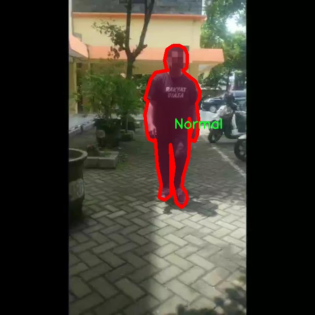

# 残疾人识别图像分割系统源码＆数据集分享
 [yolov8-seg-C2f-DCNV2＆yolov8-seg-AFPN-P345等50+全套改进创新点发刊_一键训练教程_Web前端展示]

### 1.研究背景与意义

项目参考[ILSVRC ImageNet Large Scale Visual Recognition Challenge](https://gitee.com/YOLOv8_YOLOv11_Segmentation_Studio/projects)

项目来源[AAAI Global Al lnnovation Contest](https://kdocs.cn/l/cszuIiCKVNis)

研究背景与意义

随着社会的不断发展与进步，残疾人群体的生活质量和社会参与度日益受到重视。残疾人识别技术作为辅助残疾人融入社会的重要手段，近年来得到了广泛的研究与应用。传统的残疾人识别方法多依赖于人工观察和判断，效率低下且易受主观因素影响。随着计算机视觉和深度学习技术的快速发展，基于图像处理的自动识别系统逐渐成为研究热点。其中，YOLO（You Only Look Once）系列模型因其高效的实时目标检测能力而备受关注，尤其是最新的YOLOv8版本，其在精度和速度上的优势使其成为图像分割任务的理想选择。

本研究旨在基于改进的YOLOv8模型，构建一个高效的残疾人识别图像分割系统。该系统将通过对图像进行实例分割，准确识别和分类不同类型的残疾人及其所使用的辅助设备。数据集“Yang Baru”包含6200张图像，涵盖了四个类别：辅助（Assistive）、非辅助（Non Assistive）、正常（Normal）。这一数据集的多样性和丰富性为模型的训练和验证提供了坚实的基础。通过对这些图像的分析，系统不仅能够识别残疾人及其辅助设备，还能为后续的智能辅助技术提供数据支持，推动残疾人辅助技术的进一步发展。

改进YOLOv8模型的应用，将在提高识别精度的同时，降低误识率，确保系统在复杂环境下的稳定性和可靠性。此外，实例分割技术的引入，将使得系统能够更细致地处理图像信息，区分不同类别的对象，进而实现更为精准的识别。这对于残疾人群体的日常生活和社会交往具有重要意义，能够帮助他们更好地融入社会，提升生活质量。

在全球范围内，残疾人群体的比例逐年上升，如何为这一特殊群体提供更好的服务和支持，已成为社会各界关注的焦点。通过构建基于改进YOLOv8的残疾人识别图像分割系统，不仅能够推动计算机视觉技术在社会服务领域的应用，还能够为政策制定者提供数据支持，帮助其制定更为合理的残疾人服务政策。此外，该系统的研究成果还可以为其他相关领域的研究提供借鉴，如智能监控、公共安全等。

综上所述，本研究不仅具有重要的学术价值，还具有广泛的社会意义。通过对残疾人识别技术的深入探索，我们希望能够为残疾人群体的生活带来积极的变化，促进社会的包容性发展。

### 2.图片演示


##### 注意：由于此博客编辑较早，上面“2.图片演示”和“3.视频演示”展示的系统图片或者视频可能为老版本，新版本在老版本的基础上升级如下：（实际效果以升级的新版本为准）

  （1）适配了YOLOV8的“目标检测”模型和“实例分割”模型，通过加载相应的权重（.pt）文件即可自适应加载模型。

  （2）支持“图片识别”、“视频识别”、“摄像头实时识别”三种识别模式。

  （3）支持“图片识别”、“视频识别”、“摄像头实时识别”三种识别结果保存导出，解决手动导出（容易卡顿出现爆内存）存在的问题，识别完自动保存结果并导出到tempDir中。

  （4）支持Web前端系统中的标题、背景图等自定义修改，后面提供修改教程。

  另外本项目提供训练的数据集和训练教程,暂不提供权重文件（best.pt）,需要您按照教程进行训练后实现图片演示和Web前端界面演示的效果。

### 3.视频演示

[3.1 视频演示](https://www.bilibili.com/video/BV1CaynYmEVr/)

### 4.数据集信息展示

##### 4.1 本项目数据集详细数据（类别数＆类别名）

nc: 4
names: ['Assistive', 'Non Assistive', 'Non-Assistive', 'Normal']


##### 4.2 本项目数据集信息介绍

数据集信息展示

在本研究中，我们使用了名为“Yang Baru”的数据集，以训练和改进YOLOv8-seg模型，旨在提升残疾人识别图像分割系统的性能。该数据集专门设计用于支持对不同类型辅助设备及其使用者的准确识别与分类，尤其是在图像分割任务中展现出其独特的价值。数据集包含四个主要类别，分别为“Assistive”、“Non Assistive”、“Non-Assistive”和“Normal”。这些类别的划分不仅有助于我们更好地理解和分析残疾人群体的需求，还能在技术上推动辅助技术的创新与应用。

“Assistive”类别主要包括各种辅助设备的图像，如轮椅、助行器、听力辅助器等。这些设备在帮助残疾人提高生活质量、增强独立性方面发挥着重要作用。通过对这一类别的准确识别与分割，系统能够有效地提供相关的辅助信息，帮助残疾人更好地利用这些设备。此外，准确识别辅助设备的存在与使用情况，也为后续的智能化服务提供了数据支持，例如个性化的健康管理和生活指导。

“Non Assistive”与“Non-Assistive”类别则主要涵盖那些不属于辅助设备的物品或环境元素。这些类别的设定旨在排除干扰因素，以便更清晰地识别出残疾人所处的环境与条件。这种分类不仅有助于提高模型的准确性，还能为后续的图像分析提供更为丰富的背景信息，确保系统在复杂场景下的鲁棒性和可靠性。

最后，“Normal”类别代表的是未受残疾影响的个体或环境。通过对这一类别的识别，系统能够更好地进行对比分析，进而评估辅助设备在不同环境下的有效性和必要性。这种对比不仅有助于提升系统的智能化水平，还能为政策制定者和相关机构提供重要的数据支持，以推动社会对残疾人群体的关注与支持。

“Yang Baru”数据集的构建与使用，体现了对残疾人群体需求的深刻理解与尊重。通过精确的图像分割与分类，我们的目标是开发出一种更加智能化的识别系统，能够在各种环境中快速、准确地识别出残疾人及其使用的辅助设备。这不仅有助于提升残疾人的生活质量，也为社会的包容性发展提供了技术支持。

总之，数据集“Yang Baru”在残疾人识别图像分割系统中的应用，展现了其在实际场景中的重要性与必要性。通过对不同类别的深入分析与理解，我们期待能够推动相关技术的进步，为残疾人群体创造更加友好的生活环境与条件。




### 5.全套项目环境部署视频教程（零基础手把手教学）

[5.1 环境部署教程链接（零基础手把手教学）](https://www.bilibili.com/video/BV1jG4Ve4E9t/?vd_source=bc9aec86d164b67a7004b996143742dc)


[5.2 安装Python虚拟环境创建和依赖库安装视频教程链接（零基础手把手教学）](https://www.bilibili.com/video/BV1nA4VeYEze/?vd_source=bc9aec86d164b67a7004b996143742dc)

### 6.手把手YOLOV8-seg训练视频教程（零基础小白有手就能学会）

[6.1 手把手YOLOV8-seg训练视频教程（零基础小白有手就能学会）](https://www.bilibili.com/video/BV1cA4VeYETe/?vd_source=bc9aec86d164b67a7004b996143742dc)


按照上面的训练视频教程链接加载项目提供的数据集，运行train.py即可开始训练



     Epoch   gpu_mem       box       obj       cls    labels  img_size
     1/200     0G   0.01576   0.01955  0.007536        22      1280: 100%|██████████| 849/849 [14:42<00:00,  1.04s/it]
               Class     Images     Labels          P          R     mAP@.5 mAP@.5:.95: 100%|██████████| 213/213 [01:14<00:00,  2.87it/s]
                 all       3395      17314      0.994      0.957      0.0957      0.0843

     Epoch   gpu_mem       box       obj       cls    labels  img_size
     2/200     0G   0.01578   0.01923  0.007006        22      1280: 100%|██████████| 849/849 [14:44<00:00,  1.04s/it]
               Class     Images     Labels          P          R     mAP@.5 mAP@.5:.95: 100%|██████████| 213/213 [01:12<00:00,  2.95it/s]
                 all       3395      17314      0.996      0.956      0.0957      0.0845

     Epoch   gpu_mem       box       obj       cls    labels  img_size
     3/200     0G   0.01561    0.0191  0.006895        27      1280: 100%|██████████| 849/849 [10:56<00:00,  1.29it/s]
               Class     Images     Labels          P          R     mAP@.5 mAP@.5:.95: 100%|███████   | 187/213 [00:52<00:00,  4.04it/s]
                 all       3395      17314      0.996      0.957      0.0957      0.0845


### 7.50+种全套YOLOV8-seg创新点代码加载调参视频教程（一键加载写好的改进模型的配置文件）

[7.1 50+种全套YOLOV8-seg创新点代码加载调参视频教程（一键加载写好的改进模型的配置文件）](https://www.bilibili.com/video/BV1Hw4VePEXv/?vd_source=bc9aec86d164b67a7004b996143742dc)

### 8.YOLOV8-seg图像分割算法原理

原始YOLOv8-seg算法原理

YOLOv8-seg算法是YOLO系列目标检测算法的最新版本，结合了目标检测与图像分割的能力，代表了计算机视觉领域中的一项重要进展。YOLO（You Only Look Once）算法自首次提出以来，就以其高效的实时检测能力和较高的精度而受到广泛关注。YOLOv8-seg在YOLOv8的基础上，进一步扩展了其功能，旨在同时实现目标的检测与精确的像素级分割，这对于许多应用场景，尤其是自动驾驶、医学影像分析和机器人视觉等领域，具有重要的实际意义。

YOLOv8-seg的核心思想是将目标检测任务转化为一个回归问题，利用一个单一的神经网络模型同时进行目标的定位和分类。在YOLOv8中，算法结构被划分为主干网络（backbone）、特征增强网络（neck）和检测头（head）三个主要部分。主干网络负责提取输入图像的特征，特征增强网络则通过多层次的特征融合来提升模型对不同尺度目标的检测能力，而检测头则是最终进行目标定位和分类的部分。

在YOLOv8-seg中，主干网络依然采用了CSP（Cross Stage Partial）结构，旨在提高特征提取的效率和效果。CSP结构通过将特征图分割成多个部分，并在不同的路径中进行处理，从而实现更丰富的特征表达。这种设计不仅提升了网络的学习能力，还有效减少了计算资源的消耗，使得YOLOv8-seg能够在嵌入式设备上运行，满足实时检测的需求。

特征增强网络采用了PAN-FPN（Path Aggregation Network - Feature Pyramid Network）的思想，旨在更好地融合来自不同层次的特征信息。通过特征金字塔的构建，YOLOv8-seg能够在不同尺度上获取更全面的上下文信息，进而提高对小目标和复杂场景的检测能力。PAN-FPN通过路径聚合的方式，将高层语义特征与低层细节特征进行有效结合，使得网络在处理复杂背景时，能够更好地保持目标的边界信息。

检测头部分，YOLOv8-seg采用了解耦头的结构，将目标的分类和回归任务分开处理。这种解耦设计使得模型在进行目标定位时，可以更加专注于位置的准确性，而在进行目标分类时，则能够更好地提高分类的精度。这种分离的方式有效解决了传统目标检测中常见的定位不准和分类错误的问题，尤其是在复杂场景下，解耦头的优势愈加明显。

值得一提的是，YOLOv8-seg引入了Anchor-free的目标检测方法，这一创新使得模型不再依赖于预先定义的锚点框来预测目标的位置。传统的锚点框方法在处理不同尺度和形状的目标时，往往需要进行繁琐的调整，而YOLOv8-seg通过直接回归目标的位置和大小，简化了这一过程。这种方法不仅加快了模型的收敛速度，还使得网络能够更快地聚焦于目标的实际位置，提升了检测的精度。

在训练过程中，YOLOv8-seg利用了一系列先进的损失函数设计，确保模型在优化过程中能够有效地平衡分类和回归任务的权重。通过引入自适应损失函数，YOLOv8-seg能够在不同的训练阶段动态调整损失的计算方式，从而更好地适应数据的分布特征，提高模型的泛化能力。

YOLOv8-seg的应用场景非常广泛，尤其是在需要同时进行目标检测和图像分割的任务中，其优势尤为明显。例如，在自动驾驶领域，YOLOv8-seg可以实时检测路上的行人、车辆等目标，并同时提供精确的分割信息，为后续的决策提供支持。在医学影像分析中，YOLOv8-seg能够帮助医生快速识别和分割病灶区域，提高诊断的效率和准确性。

总之，YOLOv8-seg算法在YOLO系列的基础上，融合了目标检测与图像分割的能力，凭借其高效的网络结构和创新的解耦设计，展现出了卓越的性能。随着计算机视觉技术的不断发展，YOLOv8-seg无疑将为各个领域带来更多的应用可能性和研究价值。通过进一步的优化和改进，YOLOv8-seg有望在未来的视觉任务中发挥更大的作用，推动智能化应用的深入发展。


### 9.系统功能展示（检测对象为举例，实际内容以本项目数据集为准）

图9.1.系统支持检测结果表格显示

  图9.2.系统支持置信度和IOU阈值手动调节

  图9.3.系统支持自定义加载权重文件best.pt(需要你通过步骤5中训练获得)

  图9.4.系统支持摄像头实时识别

  图9.5.系统支持图片识别

  图9.6.系统支持视频识别

  图9.7.系统支持识别结果文件自动保存

  图9.8.系统支持Excel导出检测结果数据


### 10.50+种全套YOLOV8-seg创新点原理讲解（非科班也可以轻松写刊发刊，V11版本正在科研待更新）

#### 10.1 由于篇幅限制，每个创新点的具体原理讲解就不一一展开，具体见下列网址中的创新点对应子项目的技术原理博客网址【Blog】：


[10.1 50+种全套YOLOV8-seg创新点原理讲解链接](https://gitee.com/qunmasj/good)

#### 10.2 部分改进模块原理讲解(完整的改进原理见上图和技术博客链接)【如果此小节的图加载失败可以通过CSDN或者Github搜索该博客的标题访问原始博客，原始博客图片显示正常】
### YOLOv8算法原理
YOLOv8算法由Glenn-Jocher 提出，是跟YOLOv3算法、YOLOv5算法一脉相承的，主要的改进点如下:
(1)数据预处理。YOLOv8的数据预处理依旧采用YOLOv5的策略,在训练时，主要采用包括马赛克增强(Mosaic)、混合增强(Mixup)、空间扰动(randomperspective)以及颜色扰动(HSV augment)四个增强手段。
(2)骨干网络结构。YOLOv8的骨干网络结构可从YOLOv5略见一斑，YOLOv5的主干网络的架构规律十分清晰，总体来看就是每用一层步长为2的3×3卷积去降采样特征图，接一个C3模块来进一步强化其中的特征，且C3的基本深度参数分别为“3/6/9/3”，其会根据不同规模的模型的来做相应的缩放。在的YOLOv8中，大体上也还是继承了这一特点，原先的C3模块均被替换成了新的C2f模块，C2f 模块加入更多的分支，丰富梯度回传时的支流。下面展示了YOLOv8的C2f模块和YOLOv5的C3模块，其网络结构图所示。


(3)FPN-PAN结构。YOLOv8仍采用FPN+PAN结构来构建YOLO的特征金字塔，使多尺度信息之间进行充分的融合。除了FPN-PAN里面的C3模块被替换为C2f模块外，其余部分与YOLOv5的FPN-PAN结构基本一致。
(4)Detection head结构。从 YOLOv3到 YOLOv5，其检测头一直都是“耦合”(Coupled)的,即使用一层卷积同时完成分类和定位两个任务，直到YOLOX的问世， YOLO系列才第一次换装“解耦头”(Decoupled Head)。YOLOv8也同样也采用了解耦头的结构，两条并行的分支分别取提取类别特征和位置特征，然后各用一层1x1卷积完成分类和定位任务。YOLOv8整体的网络结构由图所示。


(5)标签分配策略。尽管YOLOv5设计了自动聚类候选框的一些功能，但是聚类候选框是依赖于数据集的。若数据集不够充分，无法较为准确地反映数据本身的分布特征，聚类出来的候选框也会与真实物体尺寸比例悬殊过大。YOLOv8没有采用候选框策略，所以解决的问题就是正负样本匹配的多尺度分配。不同于YOLOX所使用的 SimOTA，YOLOv8在标签分配问题上采用了和YOLOv6相同的TOOD策略，是一种动态标签分配策略。YOLOv8只用到了targetboze。和target scores，未含是否有物体预测，故 YOLOv8的损失就主要包括两大部分∶类别损失和位置损失。对于YOLOv8，其分类损失为VFLLoss(Varifocal Loss)，其回归损失为CIoU Loss 与 DFL Loss 的形式。
其中 Varifocal Loss定义如下:


其中p为预测的类别得分，p ∈ [0.1]。q为预测的目标分数(若为真实类别，则q为预测和真值的 loU;若为其他类别。q为0 )。VFL Loss使用不对称参数来对正负样本进行加权，通过只对负样本进行衰减，达到不对等的处理前景和背景对损失的贡献。对正样本，使用q进行了加权，如果正样本的GTiou很高时,则对损失的贡献更大一些，可以让网络聚焦于那些高质量的样本上，即训练高质量的正例对AP的提升比低质量的更大一些。对负样本，使用p进行了降权，降低了负例对损失的贡献，因负样本的预测p在取次幂后会变得更小，这样就能够降低负样本对损失的整体贡献。

### 动态蛇形卷积Dynamic Snake Convolution

参考论文： 2307.08388.pdf (arxiv.org)

血管、道路等拓扑管状结构的精确分割在各个领域都至关重要，确保下游任务的准确性和效率。 然而，许多因素使任务变得复杂，包括薄的局部结构和可变的全局形态。在这项工作中，我们注意到管状结构的特殊性，并利用这些知识来指导我们的 DSCNet 在三个阶段同时增强感知：特征提取、特征融合、 和损失约束。 首先，我们提出了一种动态蛇卷积，通过自适应地关注细长和曲折的局部结构来准确捕获管状结构的特征。 随后，我们提出了一种多视图特征融合策略，以补充特征融合过程中多角度对特征的关注，确保保留来自不同全局形态的重要信息。 最后，提出了一种基于持久同源性的连续性约束损失函数，以更好地约束分割的拓扑连续性。 2D 和 3D 数据集上的实验表明，与多种方法相比，我们的 DSCNet 在管状结构分割任务上提供了更好的准确性和连续性。 我们的代码是公开的。 
主要的挑战源于细长微弱的局部结构特征与复杂多变的全局形态特征。本文关注到管状结构细长连续的特点，并利用这一信息在神经网络以下三个阶段同时增强感知：特征提取、特征融合和损失约束。分别设计了动态蛇形卷积（Dynamic Snake Convolution），多视角特征融合策略与连续性拓扑约束损失。 

我们希望卷积核一方面能够自由地贴合结构学习特征，另一方面能够在约束条件下不偏离目标结构太远。在观察管状结构的细长连续的特征后，脑海里想到了一个动物——蛇。我们希望卷积核能够像蛇一样动态地扭动，来贴合目标的结构。

我们希望卷积核一方面能够自由地贴合结构学习特征，另一方面能够在约束条件下不偏离目标结构太远。在观察管状结构的细长连续的特征后，脑海里想到了一个动物——蛇。我们希望卷积核能够像蛇一样动态地扭动，来贴合目标的结构。


### DCNV2融入YOLOv8
DCN和DCNv2（可变性卷积）
网上关于两篇文章的详细描述已经很多了，我这里具体的细节就不多讲了，只说一下其中实现起来比较困惑的点。（黑体字会讲解）

DCNv1解决的问题就是我们常规的图像增强，仿射变换（线性变换加平移）不能解决的多种形式目标变换的几何变换的问题。如下图所示。

可变性卷积的思想很简单，就是讲原来固定形状的卷积核变成可变的。如下图所示：


首先来看普通卷积，以3x3卷积为例对于每个输出y(p0)，都要从x上采样9个位置，这9个位置都在中心位置x(p0)向四周扩散得到的gird形状上，(-1,-1)代表x(p0)的左上角，(1,1)代表x(p0)的右下角，其他类似。

用公式表示如下：


可变性卷积Deformable Conv操作并没有改变卷积的计算操作，而是在卷积操作的作用区域上，加入了一个可学习的参数∆pn。同样对于每个输出y(p0)，都要从x上采样9个位置，这9个位置是中心位置x(p0)向四周扩散得到的，但是多了 ∆pn，允许采样点扩散成非gird形状。


偏移量是通过对原始特征层进行卷积得到的。比如输入特征层是w×h×c，先对输入的特征层进行卷积操作，得到w×h×2c的offset field。这里的w和h和原始特征层的w和h是一致的，offset field里面的值是输入特征层对应位置的偏移量，偏移量有x和y两个方向，所以offset field的channel数是2c。offset field里的偏移量是卷积得到的，可能是浮点数，所以接下来需要通过双向性插值计算偏移位置的特征值。在偏移量的学习中，梯度是通过双线性插值来进行反向传播的。
看到这里是不是还是有点迷茫呢？那到底程序上面怎么实现呢？


事实上由上面的公式我们可以看得出来∆pn这个偏移量是加在原像素点上的，但是我们怎么样从代码上对原像素点加这个量呢？其实很简单，就是用一个普通的卷积核去跟输入图片（一般是输入的feature_map）卷积就可以了卷积核的数量是2N也就是23*3==18（前9个通道是x方向的偏移量，后9个是y方向的偏移量），然后把这个卷积的结果与正常卷积的结果进行相加就可以了。
然后又有了第二个问题，怎么样反向传播呢？为什么会有这个问题呢？因为求出来的偏移量+正常卷积输出的结果往往是一个浮点数，浮点数是无法对应到原图的像素点的，所以自然就想到了双线性差值的方法求出浮点数对应的浮点像素点。


#### DCN v2
对于positive的样本来说，采样的特征应该focus在RoI内，如果特征中包含了过多超出RoI的内容，那么结果会受到影响和干扰。而negative样本则恰恰相反，引入一些超出RoI的特征有助于帮助网络判别这个区域是背景区域。

DCNv1引入了可变形卷积，能更好的适应目标的几何变换。但是v1可视化结果显示其感受野对应位置超出了目标范围，导致特征不受图像内容影响（理想情况是所有的对应位置分布在目标范围以内）。

为了解决该问题：提出v2, 主要有

1、扩展可变形卷积，增强建模能力
2、提出了特征模拟方案指导网络培训：feature mimicking scheme

上面这段话是什么意思呢，通俗来讲就是，我们的可变性卷积的区域大于目标所在区域，所以这时候就会对非目标区域进行错误识别。

所以自然能想到的解决方案就是加入权重项进行惩罚。（至于这个实现起来就比较简单了，直接初始化一个权重然后乘(input+offsets)就可以了）


可调节的RoIpooling也是类似的，公式如下：


### 11.项目核心源码讲解（再也不用担心看不懂代码逻辑）

#### 11.1 ultralytics\utils\tal.py

以下是经过精简和注释的核心代码部分，主要集中在对象检测的任务对齐分配器（TaskAlignedAssigner）和相关的辅助函数上。

```python
import torch
import torch.nn as nn

def select_candidates_in_gts(xy_centers, gt_bboxes, eps=1e-9):
    """
    选择在真实框(gt)中的正锚点中心。

    参数:
        xy_centers (Tensor): 形状为(h*w, 2)的张量，表示锚点中心坐标。
        gt_bboxes (Tensor): 形状为(b, n_boxes, 4)的张量，表示真实框的坐标。

    返回:
        (Tensor): 形状为(b, n_boxes, h*w)的张量，表示每个真实框中是否包含锚点中心。
    """
    n_anchors = xy_centers.shape[0]
    bs, n_boxes, _ = gt_bboxes.shape
    lt, rb = gt_bboxes.view(-1, 1, 4).chunk(2, 2)  # 左上角和右下角
    bbox_deltas = torch.cat((xy_centers[None] - lt, rb - xy_centers[None]), dim=2).view(bs, n_boxes, n_anchors, -1)
    return bbox_deltas.amin(3).gt_(eps)  # 返回是否大于eps的布尔值

class TaskAlignedAssigner(nn.Module):
    """
    任务对齐分配器，用于对象检测。

    属性:
        topk (int): 考虑的前k个候选框数量。
        num_classes (int): 对象类别数量。
        alpha (float): 分类组件的alpha参数。
        beta (float): 定位组件的beta参数。
        eps (float): 防止除以零的小值。
    """

    def __init__(self, topk=13, num_classes=80, alpha=1.0, beta=6.0, eps=1e-9):
        """初始化任务对齐分配器对象，设置超参数。"""
        super().__init__()
        self.topk = topk
        self.num_classes = num_classes
        self.bg_idx = num_classes  # 背景类别索引
        self.alpha = alpha
        self.beta = beta
        self.eps = eps

    @torch.no_grad()
    def forward(self, pd_scores, pd_bboxes, anc_points, gt_labels, gt_bboxes, mask_gt):
        """
        计算任务对齐分配。

        参数:
            pd_scores (Tensor): 形状为(bs, num_total_anchors, num_classes)的张量，表示预测的分数。
            pd_bboxes (Tensor): 形状为(bs, num_total_anchors, 4)的张量，表示预测的边界框。
            anc_points (Tensor): 形状为(num_total_anchors, 2)的张量，表示锚点坐标。
            gt_labels (Tensor): 形状为(bs, n_max_boxes, 1)的张量，表示真实框的标签。
            gt_bboxes (Tensor): 形状为(bs, n_max_boxes, 4)的张量，表示真实框的坐标。
            mask_gt (Tensor): 形状为(bs, n_max_boxes, 1)的张量，表示真实框的掩码。

        返回:
            target_labels (Tensor): 形状为(bs, num_total_anchors)的张量，表示目标标签。
            target_bboxes (Tensor): 形状为(bs, num_total_anchors, 4)的张量，表示目标边界框。
            target_scores (Tensor): 形状为(bs, num_total_anchors, num_classes)的张量，表示目标分数。
            fg_mask (Tensor): 形状为(bs, num_total_anchors)的布尔张量，表示前景锚点。
            target_gt_idx (Tensor): 形状为(bs, num_total_anchors)的张量，表示目标真实框索引。
        """
        self.bs = pd_scores.size(0)
        self.n_max_boxes = gt_bboxes.size(1)

        if self.n_max_boxes == 0:
            device = gt_bboxes.device
            return (torch.full_like(pd_scores[..., 0], self.bg_idx).to(device), 
                    torch.zeros_like(pd_bboxes).to(device),
                    torch.zeros_like(pd_scores).to(device), 
                    torch.zeros_like(pd_scores[..., 0]).to(device),
                    torch.zeros_like(pd_scores[..., 0]).to(device))

        mask_pos, align_metric, overlaps = self.get_pos_mask(pd_scores, pd_bboxes, gt_labels, gt_bboxes, anc_points, mask_gt)

        target_gt_idx, fg_mask, mask_pos = select_highest_overlaps(mask_pos, overlaps, self.n_max_boxes)

        # 计算目标标签、边界框和分数
        target_labels, target_bboxes, target_scores = self.get_targets(gt_labels, gt_bboxes, target_gt_idx, fg_mask)

        # 归一化
        align_metric *= mask_pos
        pos_align_metrics = align_metric.amax(dim=-1, keepdim=True)  # b, max_num_obj
        pos_overlaps = (overlaps * mask_pos).amax(dim=-1, keepdim=True)  # b, max_num_obj
        norm_align_metric = (align_metric * pos_overlaps / (pos_align_metrics + self.eps)).amax(-2).unsqueeze(-1)
        target_scores = target_scores * norm_align_metric

        return target_labels, target_bboxes, target_scores, fg_mask.bool(), target_gt_idx

    def get_pos_mask(self, pd_scores, pd_bboxes, gt_labels, gt_bboxes, anc_points, mask_gt):
        """获取在真实框中的锚点掩码，返回正锚点掩码、对齐度量和重叠度量。"""
        mask_in_gts = select_candidates_in_gts(anc_points, gt_bboxes)
        align_metric, overlaps = self.get_box_metrics(pd_scores, pd_bboxes, gt_labels, gt_bboxes, mask_in_gts * mask_gt)
        mask_topk = self.select_topk_candidates(align_metric, topk_mask=mask_gt.expand(-1, -1, self.topk).bool())
        mask_pos = mask_topk * mask_in_gts * mask_gt
        return mask_pos, align_metric, overlaps

    def get_box_metrics(self, pd_scores, pd_bboxes, gt_labels, gt_bboxes, mask_gt):
        """计算给定预测和真实边界框的对齐度量。"""
        na = pd_bboxes.shape[-2]
        mask_gt = mask_gt.bool()  # b, max_num_obj, h*w
        overlaps = torch.zeros([self.bs, self.n_max_boxes, na], dtype=pd_bboxes.dtype, device=pd_bboxes.device)
        bbox_scores = torch.zeros([self.bs, self.n_max_boxes, na], dtype=pd_scores.dtype, device=pd_scores.device)

        ind = torch.zeros([2, self.bs, self.n_max_boxes], dtype=torch.long)  # 2, b, max_num_obj
        ind[0] = torch.arange(end=self.bs).view(-1, 1).expand(-1, self.n_max_boxes)  # b, max_num_obj
        ind[1] = gt_labels.squeeze(-1)  # b, max_num_obj
        bbox_scores[mask_gt] = pd_scores[ind[0], :, ind[1]][mask_gt]  # b, max_num_obj, h*w

        pd_boxes = pd_bboxes.unsqueeze(1).expand(-1, self.n_max_boxes, -1, -1)[mask_gt]
        gt_boxes = gt_bboxes.unsqueeze(2).expand(-1, -1, na, -1)[mask_gt]
        overlaps[mask_gt] = bbox_iou(gt_boxes, pd_boxes, xywh=False, CIoU=True).squeeze(-1).clamp_(0)

        align_metric = bbox_scores.pow(self.alpha) * overlaps.pow(self.beta)
        return align_metric, overlaps

    def get_targets(self, gt_labels, gt_bboxes, target_gt_idx, fg_mask):
        """
        计算正锚点的目标标签、目标边界框和目标分数。

        参数:
            gt_labels (Tensor): 真实框标签，形状为(b, max_num_obj, 1)。
            gt_bboxes (Tensor): 真实框边界框，形状为(b, max_num_obj, 4)。
            target_gt_idx (Tensor): 正锚点分配的真实框索引，形状为(b, h*w)。
            fg_mask (Tensor): 布尔张量，形状为(b, h*w)，表示前景锚点。

        返回:
            (Tuple[Tensor, Tensor, Tensor]): 包含目标标签、目标边界框和目标分数的元组。
        """
        batch_ind = torch.arange(end=self.bs, dtype=torch.int64, device=gt_labels.device)[..., None]
        target_gt_idx = target_gt_idx + batch_ind * self.n_max_boxes  # (b, h*w)
        target_labels = gt_labels.long().flatten()[target_gt_idx]  # (b, h*w)

        target_bboxes = gt_bboxes.view(-1, 4)[target_gt_idx]  # (b, h*w, 4)

        target_labels.clamp_(0)

        target_scores = torch.zeros((target_labels.shape[0], target_labels.shape[1], self.num_classes),
                                    dtype=torch.int64,
                                    device=target_labels.device)  # (b, h*w, 80)
        target_scores.scatter_(2, target_labels.unsqueeze(-1), 1)

        fg_scores_mask = fg_mask[:, :, None].repeat(1, 1, self.num_classes)  # (b, h*w, 80)
        target_scores = torch.where(fg_scores_mask > 0, target_scores, 0)

        return target_labels, target_bboxes, target_scores
```

### 代码说明：
1. **选择锚点**：`select_candidates_in_gts` 函数用于选择在真实框中的锚点中心。
2. **任务对齐分配器**：`TaskAlignedAssigner` 类负责将真实框分配给锚点，计算目标标签、边界框和分数。
3. **对齐度量计算**：通过 `get_box_metrics` 方法计算预测分数和真实框之间的对齐度量。
4. **目标计算**：`get_targets` 方法根据分配的真实框索引计算目标标签、边界框和分数。

这些核心部分是对象检测中锚点分配和目标计算的关键逻辑。

这个文件是一个用于目标检测的任务对齐分配器（TaskAlignedAssigner）的实现，主要用于将真实目标（ground truth, gt）与锚框（anchors）进行匹配。该实现基于PyTorch框架，包含了一些重要的功能和方法，以下是对文件内容的详细讲解。

首先，文件导入了必要的库，包括PyTorch的核心模块和一些自定义的检查和度量模块。`check_version`用于检查PyTorch的版本，`bbox_iou`和`wasserstein_loss`用于计算边界框的交并比和Wasserstein损失。

文件中定义了几个函数，首先是`select_candidates_in_gts`，该函数用于选择在真实目标框内的锚框中心。它接受锚框中心和真实目标框作为输入，返回一个布尔张量，指示哪些锚框中心位于真实目标框内。

接下来是`select_highest_overlaps`函数，该函数用于处理锚框与多个真实目标框的重叠情况。如果一个锚框被分配给多个真实目标框，它将选择与真实目标框重叠度最高的那个。

`TaskAlignedAssigner`类是文件的核心部分。它继承自`nn.Module`，用于实现任务对齐的分配器。类的构造函数初始化了一些超参数，包括考虑的最大候选框数量、类别数量、分类和定位的权重参数等。

在`forward`方法中，主要逻辑是计算任务对齐的分配。它接受预测的分数、边界框、锚框点、真实标签和边界框等输入，返回目标标签、目标边界框、目标分数、前景掩码和目标真实索引。该方法首先检查真实目标框的数量，如果没有真实目标框，则返回背景标签和零值张量。接着，调用`get_pos_mask`方法获取正样本掩码和对齐度量，随后调用`select_highest_overlaps`选择具有最高重叠的真实目标框。

`get_pos_mask`方法用于获取在真实目标框内的锚框掩码，并计算对齐度量和重叠度。`get_box_metrics`方法计算预测边界框与真实边界框之间的对齐度量。`select_topk_candidates`方法根据给定的度量选择前k个候选框。

`get_targets`方法用于计算正样本的目标标签、目标边界框和目标分数。它根据分配的真实目标索引提取相应的标签和边界框，并生成目标分数。

此外，文件还定义了一些辅助函数，例如`make_anchors`用于生成锚框，`dist2bbox`用于将距离转换为边界框格式，`bbox2dist`用于将边界框转换为距离格式。

整体而言，这个文件实现了一个复杂的目标检测分配机制，结合了分类和定位信息，以提高模型在训练过程中的性能。通过精确地将真实目标与锚框进行匹配，能够有效地提升目标检测的准确性。

#### 11.2 ui.py

以下是代码中最核心的部分，并附上详细的中文注释：

```python
import sys
import subprocess

def run_script(script_path):
    """
    使用当前 Python 环境运行指定的脚本。

    Args:
        script_path (str): 要运行的脚本路径

    Returns:
        None
    """
    # 获取当前 Python 解释器的路径
    python_path = sys.executable

    # 构建运行命令，使用 streamlit 运行指定的脚本
    command = f'"{python_path}" -m streamlit run "{script_path}"'

    # 执行命令
    result = subprocess.run(command, shell=True)
    # 检查命令执行的返回码，如果不为0则表示出错
    if result.returncode != 0:
        print("脚本运行出错。")

# 实例化并运行应用
if __name__ == "__main__":
    # 指定要运行的脚本路径
    script_path = "web.py"  # 这里可以替换为实际的脚本路径

    # 调用函数运行脚本
    run_script(script_path)
```

### 代码注释说明：
1. **导入模块**：
   - `sys`：用于访问与 Python 解释器紧密相关的变量和函数。
   - `subprocess`：用于执行外部命令和与其交互。

2. **定义 `run_script` 函数**：
   - 该函数接收一个脚本路径作为参数，并使用当前 Python 环境运行该脚本。

3. **获取 Python 解释器路径**：
   - `sys.executable` 返回当前 Python 解释器的完整路径，确保在正确的环境中运行脚本。

4. **构建命令**：
   - 使用 f-string 格式化字符串构建运行命令，命令中包含了 Python 解释器的路径和要运行的脚本。

5. **执行命令**：
   - `subprocess.run` 方法用于执行构建的命令，并将 `shell=True` 作为参数以在 shell 中执行命令。

6. **检查返回码**：
   - 通过 `result.returncode` 检查命令的执行结果，如果返回码不为0，表示脚本运行过程中出现了错误。

7. **主程序入口**：
   - 使用 `if __name__ == "__main__":` 确保只有在直接运行该脚本时才会执行以下代码。
   - 指定要运行的脚本路径，并调用 `run_script` 函数执行该脚本。

这个程序文件名为 `ui.py`，主要功能是通过当前的 Python 环境运行一个指定的脚本，具体是使用 Streamlit 框架来启动一个 Web 应用。

首先，程序导入了必要的模块，包括 `sys`、`os` 和 `subprocess`。其中，`sys` 模块用于访问与 Python 解释器相关的变量和函数，`os` 模块提供了与操作系统交互的功能，而 `subprocess` 模块则用于创建新进程、连接到它们的输入/输出/错误管道，并获取它们的返回码。此外，还导入了 `abs_path` 函数，该函数来自 `QtFusion.path` 模块，用于获取文件的绝对路径。

接下来，定义了一个名为 `run_script` 的函数，该函数接受一个参数 `script_path`，表示要运行的脚本的路径。在函数内部，首先获取当前 Python 解释器的路径，并将其存储在 `python_path` 变量中。然后，构建一个命令字符串，该命令使用 Streamlit 运行指定的脚本。命令的格式为 `"{python_path}" -m streamlit run "{script_path}"`，其中 `{python_path}` 和 `{script_path}` 会被实际的路径替换。

随后，使用 `subprocess.run` 方法执行构建好的命令。这个方法会在 shell 中运行命令，并返回一个结果对象。通过检查 `result.returncode`，可以判断脚本是否成功运行。如果返回码不为 0，程序会输出一条错误信息，提示脚本运行出错。

最后，在 `if __name__ == "__main__":` 这部分代码中，程序指定了要运行的脚本路径，这里使用 `abs_path("web.py")` 来获取 `web.py` 文件的绝对路径。然后调用 `run_script` 函数，传入这个路径，从而启动指定的 Web 应用。

总体来说，这个程序的核心功能是通过当前 Python 环境启动一个 Streamlit 应用，提供了一种简单的方式来运行 Web 应用脚本。

#### 11.3 ultralytics\utils\autobatch.py

以下是代码中最核心的部分，并附上详细的中文注释：

```python
import numpy as np
import torch
from ultralytics.utils import LOGGER, colorstr
from ultralytics.utils.torch_utils import profile

def check_train_batch_size(model, imgsz=640, amp=True):
    """
    检查YOLO训练的最佳批量大小。

    参数:
        model (torch.nn.Module): 要检查批量大小的YOLO模型。
        imgsz (int): 用于训练的图像大小。
        amp (bool): 如果为True，则在训练中使用自动混合精度（AMP）。

    返回:
        (int): 使用autobatch()函数计算的最佳批量大小。
    """
    with torch.cuda.amp.autocast(amp):
        return autobatch(deepcopy(model).train(), imgsz)  # 计算最佳批量大小

def autobatch(model, imgsz=640, fraction=0.60, batch_size=16):
    """
    自动估计最佳YOLO批量大小，以使用可用CUDA内存的一部分。

    参数:
        model (torch.nn.Module): 要计算批量大小的YOLO模型。
        imgsz (int, optional): 用作YOLO模型输入的图像大小。默认为640。
        fraction (float, optional): 要使用的可用CUDA内存的比例。默认为0.60。
        batch_size (int, optional): 如果检测到错误，则使用的默认批量大小。默认为16。

    返回:
        (int): 最佳批量大小。
    """
    
    # 检查设备
    prefix = colorstr('AutoBatch: ')
    LOGGER.info(f'{prefix}计算imgsz={imgsz}的最佳批量大小')
    device = next(model.parameters()).device  # 获取模型设备
    if device.type == 'cpu':
        LOGGER.info(f'{prefix}未检测到CUDA，使用默认CPU批量大小 {batch_size}')
        return batch_size
    if torch.backends.cudnn.benchmark:
        LOGGER.info(f'{prefix} ⚠️ 需要torch.backends.cudnn.benchmark=False，使用默认批量大小 {batch_size}')
        return batch_size

    # 检查CUDA内存
    gb = 1 << 30  # 字节转GiB (1024 ** 3)
    properties = torch.cuda.get_device_properties(device)  # 获取设备属性
    t = properties.total_memory / gb  # GiB总内存
    r = torch.cuda.memory_reserved(device) / gb  # GiB保留内存
    a = torch.cuda.memory_allocated(device) / gb  # GiB已分配内存
    f = t - (r + a)  # GiB可用内存
    LOGGER.info(f'{prefix}{device} ({properties.name}) {t:.2f}G总内存, {r:.2f}G保留, {a:.2f}G已分配, {f:.2f}G可用')

    # 配置批量大小
    batch_sizes = [1, 2, 4, 8, 16]
    try:
        img = [torch.empty(b, 3, imgsz, imgsz) for b in batch_sizes]  # 创建空图像张量
        results = profile(img, model, n=3, device=device)  # 评估不同批量大小的性能

        # 拟合解决方案
        y = [x[2] for x in results if x]  # 提取内存使用情况
        p = np.polyfit(batch_sizes[:len(y)], y, deg=1)  # 一次多项式拟合
        b = int((f * fraction - p[1]) / p[0])  # 计算最佳批量大小
        if None in results:  # 如果某些大小失败
            i = results.index(None)  # 找到第一个失败的索引
            if b >= batch_sizes[i]:  # 如果最佳批量大小在失败点之上
                b = batch_sizes[max(i - 1, 0)]  # 选择安全的前一个点
        if b < 1 or b > 1024:  # 如果最佳批量大小超出安全范围
            b = batch_size
            LOGGER.info(f'{prefix}警告 ⚠️ 检测到CUDA异常，使用默认批量大小 {batch_size}.')

        fraction = (np.polyval(p, b) + r + a) / t  # 预测的实际内存使用比例
        LOGGER.info(f'{prefix}使用批量大小 {b}，在 {device} 上 {t * fraction:.2f}G/{t:.2f}G ({fraction * 100:.0f}%) ✅')
        return b
    except Exception as e:
        LOGGER.warning(f'{prefix}警告 ⚠️ 检测到错误: {e}, 使用默认批量大小 {batch_size}.')
        return batch_size
```

### 代码核心部分说明：
1. **check_train_batch_size**: 该函数用于检查给定YOLO模型的最佳训练批量大小。它会使用自动混合精度（AMP）来提高计算效率。
  
2. **autobatch**: 该函数的主要功能是自动估计最佳批量大小，以便在训练时合理利用CUDA内存。它会检查设备类型、CUDA内存情况，并根据不同的批量大小进行性能评估，最终返回一个最佳的批量大小。

3. **CUDA内存检查**: 代码中通过获取设备的总内存、已保留内存和已分配内存来计算可用内存，并输出相关信息。

4. **批量大小拟合**: 通过对不同批量大小的内存使用情况进行线性拟合，来预测最佳的批量大小，并确保其在合理范围内。

5. **异常处理**: 在执行过程中，如果发生任何异常，将记录警告并返回默认的批量大小。

这个程序文件的主要功能是估算在使用PyTorch进行YOLO模型训练时，最佳的批处理大小（batch size），以便有效利用可用的CUDA内存。文件中定义了几个函数，主要包括`check_train_batch_size`和`autobatch`。

首先，`check_train_batch_size`函数接收一个YOLO模型、图像大小和一个布尔值（表示是否使用自动混合精度）作为参数。它通过调用`autobatch`函数来计算最佳的批处理大小。在执行计算时，如果启用了自动混合精度（AMP），则会使用`torch.cuda.amp.autocast`上下文管理器来优化内存使用。

接下来是`autobatch`函数，它是这个文件的核心。该函数接收YOLO模型、图像大小、可用CUDA内存的使用比例和默认批处理大小作为参数。函数首先检查模型所在的设备，如果设备是CPU，则返回默认的批处理大小。如果CUDA环境不符合要求（例如，`torch.backends.cudnn.benchmark`为True），也会返回默认的批处理大小。

函数会检查CUDA内存的使用情况，包括总内存、已保留内存、已分配内存和可用内存，并将这些信息记录到日志中。接着，函数会定义一个批处理大小的列表（1, 2, 4, 8, 16），并为每个批处理大小创建一个空的图像张量。通过调用`profile`函数来评估不同批处理大小下的内存使用情况。

在获取到内存使用数据后，函数会使用一阶多项式拟合来计算最佳的批处理大小。通过计算得到的y截距，函数可以估算出在给定的可用内存下，能够使用的最佳批处理大小。如果在某些批处理大小下出现了错误，函数会选择上一个安全的批处理大小作为备选。此外，函数还会检查计算出的批处理大小是否在安全范围内（1到1024之间），如果不在，则使用默认的批处理大小。

最后，函数会记录使用的批处理大小和实际使用的内存比例，并返回计算出的最佳批处理大小。如果在计算过程中发生异常，函数会记录警告并返回默认的批处理大小。

总体来说，这个文件提供了一种动态计算YOLO模型训练时最佳批处理大小的方法，以便在训练过程中高效利用GPU资源。

#### 11.4 ultralytics\models\fastsam\model.py

```python
# Ultralytics YOLO 🚀, AGPL-3.0 license

from pathlib import Path  # 导入Path类，用于处理文件路径
from ultralytics.engine.model import Model  # 从ultralytics库中导入Model类

from .predict import FastSAMPredictor  # 导入FastSAMPredictor类，用于预测
from .val import FastSAMValidator  # 导入FastSAMValidator类，用于验证


class FastSAM(Model):
    """
    FastSAM模型接口。

    示例：
        ```python
        from ultralytics import FastSAM

        model = FastSAM('last.pt')  # 创建FastSAM模型实例
        results = model.predict('ultralytics/assets/bus.jpg')  # 使用模型进行预测
        ```
    """

    def __init__(self, model='FastSAM-x.pt'):
        """初始化FastSAM类，调用父类Model的__init__方法，并设置默认模型。"""
        # 如果传入的模型名称是'FastSAM.pt'，则将其更改为'FastSAM-x.pt'
        if str(model) == 'FastSAM.pt':
            model = 'FastSAM-x.pt'
        # 确保模型文件后缀不是.yaml或.yml，FastSAM模型只支持预训练模型
        assert Path(model).suffix not in ('.yaml', '.yml'), 'FastSAM models only support pre-trained models.'
        # 调用父类的初始化方法，设置模型和任务类型为'segment'
        super().__init__(model=model, task='segment')

    @property
    def task_map(self):
        """返回一个字典，将分割任务映射到相应的预测器和验证器类。"""
        return {'segment': {'predictor': FastSAMPredictor, 'validator': FastSAMValidator}}
```

### 代码核心部分注释说明：
1. **导入模块**：导入了处理文件路径的`Path`类，以及`Model`类和相关的预测、验证类。
2. **FastSAM类**：继承自`Model`类，构建了一个FastSAM模型接口。
3. **初始化方法**：在初始化时，检查模型名称并确保其后缀符合要求，调用父类的初始化方法以设置模型和任务类型。
4. **任务映射**：定义了一个属性`task_map`，返回一个字典，映射分割任务到相应的预测器和验证器类。

这个程序文件定义了一个名为 `FastSAM` 的类，它是 Ultralytics YOLO 模型的一部分，主要用于图像分割任务。文件首先导入了一些必要的模块，包括 `Path` 类用于处理文件路径，以及从 `ultralytics.engine.model` 导入的 `Model` 类，后者是 `FastSAM` 类的父类。此外，还导入了 `FastSAMPredictor` 和 `FastSAMValidator`，这两个类分别用于预测和验证。

`FastSAM` 类的文档字符串中给出了一个简单的使用示例，展示了如何加载模型并对一张图片进行预测。用户可以通过创建 `FastSAM` 类的实例并传入模型文件的路径来使用该模型，随后可以调用 `predict` 方法对指定的图像进行处理。

在 `__init__` 方法中，类首先检查传入的模型名称。如果模型名称是 `'FastSAM.pt'`，则将其更改为 `'FastSAM-x.pt'`。接着，使用 `assert` 语句确保传入的模型文件不是 YAML 格式，因为 `FastSAM` 模型只支持预训练模型。最后，调用父类的 `__init__` 方法，传入模型路径和任务类型（这里是 `'segment'`，表示分割任务）。

类中还有一个名为 `task_map` 的属性，它返回一个字典，该字典将任务类型（在这里是 `'segment'`）映射到相应的预测器和验证器类。这使得在处理不同任务时，可以方便地找到对应的处理类。

总体而言，这个文件的主要功能是定义一个接口，使得用户能够方便地使用 FastSAM 模型进行图像分割，并提供了必要的类和方法以支持这一功能。

#### 11.5 ultralytics\models\rtdetr\__init__.py

以下是保留的核心代码部分，并附上详细的中文注释：

```python
# 导入RTDETR模型、预测器和验证器
from .model import RTDETR  # 导入RTDETR模型类
from .predict import RTDETRPredictor  # 导入RTDETR预测器类
from .val import RTDETRValidator  # 导入RTDETR验证器类

# 定义模块的公开接口，允许外部访问这些类
__all__ = 'RTDETRPredictor', 'RTDETRValidator', 'RTDETR'  # 指定可被外部导入的类
```

### 注释说明：
1. **导入部分**：
   - `from .model import RTDETR`：从当前模块的`model`文件中导入`RTDETR`类，这个类通常用于定义模型的结构和参数。
   - `from .predict import RTDETRPredictor`：从当前模块的`predict`文件中导入`RTDETRPredictor`类，这个类用于对输入数据进行预测。
   - `from .val import RTDETRValidator`：从当前模块的`val`文件中导入`RTDETRValidator`类，这个类用于验证模型的性能。

2. **公开接口**：
   - `__all__`：这是一个特殊的变量，用于定义当使用`from module import *`时，哪些类或函数是可以被导入的。在这里，`RTDETRPredictor`、`RTDETRValidator`和`RTDETR`都是被允许导出的类。

这个程序文件是一个Python模块的初始化文件，位于Ultralytics YOLO项目的RTDETR子目录下。文件的开头包含了一条注释，说明该项目使用的是AGPL-3.0许可证，并且标志着这是Ultralytics YOLO的一部分。

接下来，文件通过相对导入的方式引入了三个类：`RTDETR`、`RTDETRPredictor`和`RTDETRValidator`。这些类分别定义在同一目录下的不同文件中，具体来说，`RTDETR`类在`model.py`文件中，`RTDETRPredictor`类在`predict.py`文件中，而`RTDETRValidator`类则在`val.py`文件中。

最后，`__all__`变量被定义为一个包含字符串的元组，列出了该模块公开的接口。这个变量的作用是控制从该模块中使用`from module import *`语句时，哪些名称会被导入。在这里，只有`RTDETRPredictor`、`RTDETRValidator`和`RTDETR`这三个类会被导入，其他未列出的名称则不会被导入。这种做法有助于维护模块的封装性和清晰性，确保用户只接触到模块的核心功能。

#### 11.6 train.py

以下是经过简化和注释的核心代码部分：

```python
import os
import torch
import yaml
from ultralytics import YOLO  # 导入YOLO模型库

if __name__ == '__main__':  # 确保该模块被直接运行时才执行以下代码
    # 设置训练参数
    workers = 1  # 数据加载的工作进程数
    batch = 8  # 每个批次的样本数量
    device = "0" if torch.cuda.is_available() else "cpu"  # 检查是否有可用的GPU，选择设备

    # 获取数据集配置文件的绝对路径
    data_path = abs_path(f'datasets/data/data.yaml', path_type='current')

    # 读取YAML文件，保持原有顺序
    with open(data_path, 'r') as file:
        data = yaml.load(file, Loader=yaml.FullLoader)

    # 修改数据集中训练、验证和测试的路径
    if 'train' in data and 'val' in data and 'test' in data:
        directory_path = os.path.dirname(data_path)  # 获取目录路径
        data['train'] = os.path.join(directory_path, 'train')  # 更新训练集路径
        data['val'] = os.path.join(directory_path, 'val')  # 更新验证集路径
        data['test'] = os.path.join(directory_path, 'test')  # 更新测试集路径

        # 将修改后的数据写回YAML文件
        with open(data_path, 'w') as file:
            yaml.safe_dump(data, file, sort_keys=False)

    # 加载YOLO模型配置和预训练权重
    model = YOLO(r"path/to/yolov8-seg-C2f-Faster.yaml").load("./weights/yolov8s-seg.pt")

    # 开始训练模型
    results = model.train(
        data=data_path,  # 指定训练数据的配置文件路径
        device=device,  # 指定训练设备
        workers=workers,  # 数据加载的工作进程数
        imgsz=640,  # 输入图像的大小
        epochs=100,  # 训练的轮数
        batch=batch,  # 每个批次的样本数量
    )
```

### 代码注释说明：
1. **导入必要的库**：导入操作系统、PyTorch、YAML解析库和YOLO模型库。
2. **主程序入口**：`if __name__ == '__main__':` 确保只有在直接运行该脚本时才执行后续代码。
3. **设置训练参数**：
   - `workers`：设置数据加载的工作进程数。
   - `batch`：设置每个批次的样本数量。
   - `device`：根据是否有可用的GPU选择训练设备。
4. **读取和修改数据集配置**：
   - 读取YAML文件并保持原有顺序。
   - 更新训练、验证和测试数据集的路径。
   - 将修改后的数据写回YAML文件。
5. **加载YOLO模型**：指定模型配置文件和预训练权重。
6. **开始训练模型**：调用`model.train()`方法进行模型训练，传入相关参数。

该程序文件 `train.py` 是一个用于训练 YOLO（You Only Look Once）模型的脚本。首先，程序导入了必要的库，包括操作系统库 `os`、深度学习框架 `torch`、YAML 处理库 `yaml` 以及 YOLO 模型库 `ultralytics`。此外，还导入了 `QtFusion.path` 中的 `abs_path` 函数，用于获取文件的绝对路径，并设置了 Matplotlib 的后端为 `TkAgg`。

在 `__main__` 代码块中，程序首先定义了一些训练参数，包括工作进程数 `workers`、批次大小 `batch` 和设备选择 `device`。设备选择会根据是否有可用的 GPU 来决定，如果有则使用 GPU（设备编号为 "0"），否则使用 CPU。

接下来，程序通过 `abs_path` 函数获取数据集配置文件 `data.yaml` 的绝对路径，并将路径格式转换为 Unix 风格，以便于后续处理。然后，程序读取 YAML 文件，解析出数据集的相关信息。若 YAML 文件中包含 `train`、`val` 和 `test` 字段，程序会将这些字段的路径修改为相对于当前目录的路径，并将修改后的数据重新写回 YAML 文件。

程序中还提到，不同的 YOLO 模型对设备的要求不同，因此如果遇到显存不足的错误，可以尝试使用其他模型配置文件进行测试。接着，程序加载了一个特定的 YOLO 模型配置文件，并加载了预训练的权重文件。

最后，程序调用 `model.train` 方法开始训练模型，指定了训练数据的配置文件路径、设备、工作进程数、输入图像大小、训练的 epoch 数量以及批次大小等参数。训练过程会根据这些设置进行模型的训练。

### 12.系统整体结构（节选）

### 整体功能和构架概括

该项目是一个基于Ultralytics YOLO的目标检测和图像分割框架，提供了多种模型和工具，旨在实现高效的训练和推理。项目的架构包含了模型定义、数据处理、训练过程、自动批处理、用户界面等多个模块，支持不同的深度学习任务，如目标检测和图像分割。整体上，项目通过模块化设计，使得各个功能可以独立开发和维护，同时又能通过接口相互协作。

### 文件功能整理表

| 文件路径                                      | 功能描述                                                   |
|-----------------------------------------------|----------------------------------------------------------|
| `ultralytics/utils/tal.py`                   | 实现目标检测的任务对齐分配器，计算最佳的锚框与真实目标的匹配。 |
| `ui.py`                                       | 启动一个Streamlit Web应用，用于可视化和交互操作。         |
| `ultralytics/utils/autobatch.py`             | 动态计算YOLO模型训练时的最佳批处理大小，以优化GPU内存使用。 |
| `ultralytics/models/fastsam/model.py`        | 定义FastSAM类，用于图像分割任务，提供模型加载和预测功能。   |
| `ultralytics/models/rtdetr/__init__.py`      | 初始化RTDETR模块，导入相关的模型、预测器和验证器类。      |
| `train.py`                                    | 训练YOLO模型的主脚本，处理数据集配置和训练参数设置。      |
| `ultralytics/nn/extra_modules/ops_dcnv3/setup.py` | 配置和安装DCNv3模块的设置脚本。                          |
| `ultralytics/nn/backbone/VanillaNet.py`      | 定义VanillaNet模型，作为YOLO模型的骨干网络之一。          |
| `ultralytics/data/base.py`                    | 提供数据集的基本类和接口，用于数据加载和预处理。          |
| `ultralytics/nn/backbone/EfficientFormerV2.py` | 定义EfficientFormerV2模型，作为YOLO模型的另一种骨干网络。  |
| `ultralytics/data/augment.py`                 | 实现数据增强功能，提升模型的泛化能力。                    |
| `ultralytics/models/utils/__init__.py`       | 初始化模型工具模块，导入相关的工具函数和类。              |
| `ultralytics/data/annotator.py`               | 提供图像标注功能，用于可视化检测结果和数据标注。            |

这个表格总结了项目中各个文件的主要功能，帮助理解项目的整体结构和各个模块之间的关系。

注意：由于此博客编辑较早，上面“11.项目核心源码讲解（再也不用担心看不懂代码逻辑）”中部分代码可能会优化升级，仅供参考学习，完整“训练源码”、“Web前端界面”和“50+种创新点源码”以“14.完整训练+Web前端界面+50+种创新点源码、数据集获取”的内容为准。

### 13.图片、视频、摄像头图像分割Demo(去除WebUI)代码

在这个博客小节中，我们将讨论如何在不使用WebUI的情况下，实现图像分割模型的使用。本项目代码已经优化整合，方便用户将分割功能嵌入自己的项目中。
核心功能包括图片、视频、摄像头图像的分割，ROI区域的轮廓提取、类别分类、周长计算、面积计算、圆度计算以及颜色提取等。
这些功能提供了良好的二次开发基础。

### 核心代码解读

以下是主要代码片段，我们会为每一块代码进行详细的批注解释：

```python
import random
import cv2
import numpy as np
from PIL import ImageFont, ImageDraw, Image
from hashlib import md5
from model import Web_Detector
from chinese_name_list import Label_list

# 根据名称生成颜色
def generate_color_based_on_name(name):
    ......

# 计算多边形面积
def calculate_polygon_area(points):
    return cv2.contourArea(points.astype(np.float32))

...
# 绘制中文标签
def draw_with_chinese(image, text, position, font_size=20, color=(255, 0, 0)):
    image_pil = Image.fromarray(cv2.cvtColor(image, cv2.COLOR_BGR2RGB))
    draw = ImageDraw.Draw(image_pil)
    font = ImageFont.truetype("simsun.ttc", font_size, encoding="unic")
    draw.text(position, text, font=font, fill=color)
    return cv2.cvtColor(np.array(image_pil), cv2.COLOR_RGB2BGR)

# 动态调整参数
def adjust_parameter(image_size, base_size=1000):
    max_size = max(image_size)
    return max_size / base_size

# 绘制检测结果
def draw_detections(image, info, alpha=0.2):
    name, bbox, conf, cls_id, mask = info['class_name'], info['bbox'], info['score'], info['class_id'], info['mask']
    adjust_param = adjust_parameter(image.shape[:2])
    spacing = int(20 * adjust_param)

    if mask is None:
        x1, y1, x2, y2 = bbox
        aim_frame_area = (x2 - x1) * (y2 - y1)
        cv2.rectangle(image, (x1, y1), (x2, y2), color=(0, 0, 255), thickness=int(3 * adjust_param))
        image = draw_with_chinese(image, name, (x1, y1 - int(30 * adjust_param)), font_size=int(35 * adjust_param))
        y_offset = int(50 * adjust_param)  # 类别名称上方绘制，其下方留出空间
    else:
        mask_points = np.concatenate(mask)
        aim_frame_area = calculate_polygon_area(mask_points)
        mask_color = generate_color_based_on_name(name)
        try:
            overlay = image.copy()
            cv2.fillPoly(overlay, [mask_points.astype(np.int32)], mask_color)
            image = cv2.addWeighted(overlay, 0.3, image, 0.7, 0)
            cv2.drawContours(image, [mask_points.astype(np.int32)], -1, (0, 0, 255), thickness=int(8 * adjust_param))

            # 计算面积、周长、圆度
            area = cv2.contourArea(mask_points.astype(np.int32))
            perimeter = cv2.arcLength(mask_points.astype(np.int32), True)
            ......

            # 计算色彩
            mask = np.zeros(image.shape[:2], dtype=np.uint8)
            cv2.drawContours(mask, [mask_points.astype(np.int32)], -1, 255, -1)
            color_points = cv2.findNonZero(mask)
            ......

            # 绘制类别名称
            x, y = np.min(mask_points, axis=0).astype(int)
            image = draw_with_chinese(image, name, (x, y - int(30 * adjust_param)), font_size=int(35 * adjust_param))
            y_offset = int(50 * adjust_param)

            # 绘制面积、周长、圆度和色彩值
            metrics = [("Area", area), ("Perimeter", perimeter), ("Circularity", circularity), ("Color", color_str)]
            for idx, (metric_name, metric_value) in enumerate(metrics):
                ......

    return image, aim_frame_area

# 处理每帧图像
def process_frame(model, image):
    pre_img = model.preprocess(image)
    pred = model.predict(pre_img)
    det = pred[0] if det is not None and len(det)
    if det:
        det_info = model.postprocess(pred)
        for info in det_info:
            image, _ = draw_detections(image, info)
    return image

if __name__ == "__main__":
    cls_name = Label_list
    model = Web_Detector()
    model.load_model("./weights/yolov8s-seg.pt")

    # 摄像头实时处理
    cap = cv2.VideoCapture(0)
    while cap.isOpened():
        ret, frame = cap.read()
        if not ret:
            break
        ......

    # 图片处理
    image_path = './icon/OIP.jpg'
    image = cv2.imread(image_path)
    if image is not None:
        processed_image = process_frame(model, image)
        ......

    # 视频处理
    video_path = ''  # 输入视频的路径
    cap = cv2.VideoCapture(video_path)
    while cap.isOpened():
        ret, frame = cap.read()
        ......
```


### 14.完整训练+Web前端界面+50+种创新点源码、数据集获取


# [下载链接：https://mbd.pub/o/bread/Zp2bkpZp](https://mbd.pub/o/bread/Zp2bkpZp)